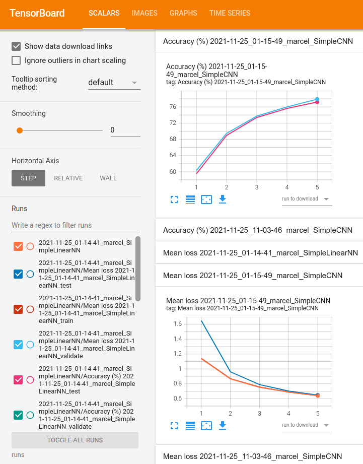

# Summary

This `simple_pytorch_example` project is a toy example of a python script that instantiates and trains a PyTorch neural network on the FashionMNIST dataset with several common and useful features:
* Choose between two different neural network architectures
* Make architectures parametrizable
* Read input arguments from config file or command line 
  * (command line arguments override config file ones)
* Download FashionMNIST dataset if not already downloaded
* Monitor training progress on the terminal and/or with TensorBoard logs
  * Accuracy, loss, confusion matrix

More details about FashionMNIST can be found [here](https://github.com/zalandoresearch/fashion-mnist).

It may be useful as a starting point for people who are starting to learn about PyTorch and neural networks.

## Prerequisites

We assume that most users will have a GPU driver correctly configured, although the script can also be run on the CPU.

The project should work with your preferred python environment, but I have only tested it with conda 
([MiniConda 3](https://docs.conda.io/projects/conda/en/latest/user-guide/install/linux.html)) local environments. 
To create a local environment for this project,

```shell
conda create --name simple_pytorch_example python=3.9
```

and then activate it with

```shell
conda activate simple_pytorch_example
```

## Installation on Ubuntu Linux 

(Tested on Ubuntu Linux Focal 20.04.3 LTS)

Go to the directory where you want to have the project, e.g.

```shell
cd Software
```

Clone the [simple_pytorch_example](https://github.com/rcasero/simple_pytorch_example) github repository

```shell
git clone https://github.com/rcasero/simple_pytorch_example.git
```

Install the python dependencies

```shell
cd simple_pytorch_example
python setup.py install
```

## `train_simple_pytorch_example.py`: Main script to train the neural network

You can run the script `train_simple_pytorch_example.py` as

```shell
./train_simple_pytorch_example.py [options]
```

or

```shell
python train_simple_pytorch_example.py [options]
```

### Usage summary

```shell
usage: train_simple_pytorch_example.py [-h] [-c CONFIG_FILE] [-v] [--workdir DIR] [-d STR] [-e N] [-b N] [-l F] [--validation_ratio F] [-n STR] [--conv_out_features N [N ...]]
                                       [--conv_kernel_size N] [--maxpool_kernel_size N]

optional arguments:
  -h, --help            show this help message and exit
  -c CONFIG_FILE, --config CONFIG_FILE
                        config file path
  -v, --verbose         verbose output for debugging
  --workdir DIR         working directory to place data, logs, weights, etc subdirectories (def .)
  -d STR, --device STR  device to train on (def 'cuda', 'cpu')
  -e N, --epochs N      number of epochs for training (def 10)
  -b N, --batch_size N  batch size for training (def 64)
  -l F, --learning_rate F
                        learning rate for training (def 1e-3)
  --validation_ratio F  ratio of training dataset reserved for validation (def 0.0)
  -n STR, --nn STR      neural network architecture (def 'SimpleCNN', 'SimpleLinearNN')
  --conv_out_features N [N ...]
                        (SimpleCNN only) number of output features for each convolutional block (def 8 16)
  --conv_kernel_size N  (SimpleCNN only) kernel size of convolutional layers (def 3)
  --maxpool_kernel_size N
                        (SimpleCNN only) kernel size of max pool layers (def 2)

Args that start with '--' (eg. -v) can also be set in a config file (specified via -c). Config file syntax allows: key=value, flag=true, stuff=[a,b,c]
(for details, see syntax at https://goo.gl/R74nmi). If an arg is specified in more than one place, then commandline values override config file values
which override defaults.
```

Options not provided to the script take default values, e.g. running `./train_simple_pytorch_example.py -v` produces the output

```shell
** Arg breakdown (defaults / config file / command line):
Command Line Args:   -v
Defaults:
  --workdir:         .
  --device:          cuda
  --epochs:          10
  --batch_size:      64
  --learning_rate:   0.001
  --validation_ratio:0.0
  --nn:              SimpleCNN
  --conv_out_features:[8, 16]
  --conv_kernel_size:3
  --maxpool_kernel_size:2
```

Arguments that start with `--` can have their default values overridden using a configuration file (`-c CONFIG_FILE`).
A configuration file is just a text file (e.g. `config.txt`) that looks like this:

```text
device = cuda
epochs = 20
batch_size = 64
learning_rate = 1e-3
validation_ratio = 0.2
nn = SimpleCNN
conv_out_features = [8, 16]
conv_kernel_size = 3
maxpool_kernel_size = 2
```

Note that when running `./train_simple_pytorch_example.py -v -c config.txt` the defaults have been replaced by the arguments provided in the 
config file:

```shell
** Arg breakdown (defaults / config file / command line):
Command Line Args:   -v -c config.txt
Config File (config.txt):
  device:            cuda
  epochs:            20
  batch_size:        64
  learning_rate:     1e-3
  validation_ratio:  0.2
  nn:                SimpleCNN
  conv_out_features: [8, 16]
  conv_kernel_size:  3
  maxpool_kernel_size:2
Defaults:
  --workdir:         .
```

Command line arguments override both defaults and configuration file arguments, e.g.

```shell
./train_simple_pytorch_example.py --nn SimpleCNN -v --conv_out_features 8 16 32 -e 5
```

### FashionMNIST data download

When `train_simple_pytorch_example.py` runs, it checks whether the FashionMNIST data has already been downloaded to `WORKDIR/data`, and if 
not, it downloads it automatically.

### Network architectures

We provide two neural network architectures that can be selected with option `--nn SimpleLinearNN` or `--nn SimpleCNN`.

`SimpleLinearNN` is a network with fully connected layers

```text
==========================================================================================
Layer (type:depth-idx)                   Output Shape              Param #
==========================================================================================
SimpleLinearNN                           --                        --
├─Flatten: 1-1                           [1, 784]                  --
├─Sequential: 1-2                        [1, 10]                   --
│    └─Linear: 2-1                       [1, 512]                  401,920
│    └─ReLU: 2-2                         [1, 512]                  --
│    └─Linear: 2-3                       [1, 512]                  262,656
│    └─ReLU: 2-4                         [1, 512]                  --
│    └─Linear: 2-5                       [1, 10]                   5,130
==========================================================================================
```

`SimpleCNN` is a traditional convolutional neural network (CNN) formed by concatenation of convolutional blocks
(Conv2d + ReLU + MaxPool2d + BatchNorm2d). Those blocks are followed by a 1x1 convolution and a fully connected layer
with 10 outputs. The hyperparameters that the user can configure are (they are ignored for the other network):
* `--conv_kernel_size N`: Size of the convolutional kernels (NxN, dafault 3x3).
* `--maxpool_kernel_size N`: Size of the maxpool kernels (NxN, dafault 2x2).
* `--conv_out_features N1 [N2 ...]`: Each number adds a convolutional block with the corresponding number of output 
features. E.g. `--conv_out_features 8 16 32` creates a network with 3 blocks

```text
==========================================================================================
Layer (type:depth-idx)                   Output Shape              Param #
==========================================================================================
SimpleCNN                                --                        --
├─ModuleList: 1-1                        --                        --
│    └─Conv2d: 2-1                       [1, 8, 28, 28]            80
│    └─ReLU: 2-2                         [1, 8, 28, 28]            --
│    └─MaxPool2d: 2-3                    [1, 8, 14, 14]            --
│    └─BatchNorm2d: 2-4                  [1, 8, 14, 14]            16
│    └─Conv2d: 2-5                       [1, 16, 14, 14]           1,168
│    └─ReLU: 2-6                         [1, 16, 14, 14]           --
│    └─MaxPool2d: 2-7                    [1, 16, 7, 7]             --
│    └─BatchNorm2d: 2-8                  [1, 16, 7, 7]             32
│    └─Conv2d: 2-9                       [1, 32, 7, 7]             4,640
│    └─ReLU: 2-10                        [1, 32, 7, 7]             --
│    └─MaxPool2d: 2-11                   [1, 32, 3, 3]             --
│    └─BatchNorm2d: 2-12                 [1, 32, 3, 3]             64
│    └─Conv2d: 2-13                      [1, 1, 3, 3]              289
│    └─Flatten: 2-14                     [1, 9]                    --
│    └─Linear: 2-15                      [1, 10]                   100
==========================================================================================
```

### General training options

Currently, the loss (`torch.nn.CrossEntropyLoss`) and optimizer (`torch.optim.SGD`) are fixed.

Parameters common to both architectures are
* `--epochs N`: number of training epochs.
* `--batch_size N`: size of the training batch (if the dataset size is not a multiple of the batch size, the last batch 
will be smaller).
* `--learning_rate F`: learning rate.
* `--validation_ratio F`: by default, the script uses all the training data in FashionMNIST for training. But the user
can choose to split the training data between training and validation. (The test data is a separate dataset in 
FashionMNIST).

### Output network parameters

Once the network is trained, the `model.state_dict()` is saved to `WORKDIR/models/LOGFILENAME.state_dict`.

### Monitoring

Option `--verbose` outputs detailed information about the script arguments, datasets, network architecture and training 
progress.

```text
** Training:
Epoch 1/10
-------------------------------
train mean loss: 2.3913  [     0/ 60000]
train mean loss: 2.1813  [  6400/ 60000]
train mean loss: 2.1227  [ 12800/ 60000]
train mean loss: 2.0780  [ 19200/ 60000]
train mean loss: 1.9196  [ 25600/ 60000]
train mean loss: 1.6919  [ 32000/ 60000]
train mean loss: 1.4112  [ 38400/ 60000]
train mean loss: 1.2632  [ 44800/ 60000]
train mean loss: 1.0215  [ 51200/ 60000]
train mean loss: 0.8559  [ 57600/ 60000]
Training: Mean loss: 1.6672
Test: Accuracy: 63.8%, Mean loss: 0.9794
Validation: Accuracy: nan%, Mean loss:    nan
Epoch 2/10
-------------------------------
train mean loss: 1.0026  [     0/ 60000]
train mean loss: 0.8822  [  6400/ 60000]
...
```

Training progress can also be monitored with [TensorBoard](https://www.tensorflow.org/tensorboard). The script saves 
TensorBoard logs to `WORKDIR/runs`, with a filename formed by the date (YYYY-MM-DD), time (HH-MM-SS), hostname and network architecture (e.g. `2021-11-25_01-15-49_marcel_SimpleCNN`). To monitor the logs either during training or afterwards, run

```shell
tensorboard --logdir=runs &
```

and browse the URL displayed on the terminal, e.g. http://localhost:6006/. 

If you are working remotely on the GPU server, you need to forward the remote server's port to your local machine

```shell
ssh -L 6006:localhost:6006 REMOTE_USERNAME@SERVER_IP 
```


We provide plots for Accuracy (%), Mean loss and the Confusion Matrix 




## Results

### SimpleLinearNN

Experiment `2021-11-26_01-33-52_marcel_SimpleLinearNN` run with parameters:

`./train_simple_pytorch_example.py -v --nn SimpleLinearNN --validation_ratio 0.2 -e 100`

```text
** All args:
Namespace(config_file=None, verbose=True, workdir='.', device='cuda', epochs=100, batch_size=64, learning_rate=0.001, validation_ratio=0.2, nn='SimpleLinearNN', conv_out_features=[8, 16], conv_kernel_size=3, maxpool_kernel_size=2)
** Arg breakdown (defaults / config file / command line):
Command Line Args:   -v --nn SimpleLinearNN --validation_ratio 0.2 -e 100
Defaults:
  --workdir:         .
  --device:          cuda
  --batch_size:      64
  --learning_rate:   0.001
  --conv_out_features:[8, 16]
  --conv_kernel_size:3
  --maxpool_kernel_size:2

** GPU found:
NVIDIA GeForce GTX 1050
** Datasets:
Image size (H, W): (28, 28)
Training samples: 48000
Validation samples: 12000
Testing samples: 10000
Classes: {'T-shirt/top': 0, 'Trouser': 1, 'Pullover': 2, 'Dress': 3, 'Coat': 4, 'Sandal': 5, 'Shirt': 6, 'Sneaker': 7, 'Bag': 8, 'Ankle boot': 9}
** Neural network architecture:
==========================================================================================
Layer (type:depth-idx)                   Output Shape              Param #
==========================================================================================
SimpleLinearNN                           --                        --
├─Flatten: 1-1                           [1, 784]                  --
├─Sequential: 1-2                        [1, 10]                   --
│    └─Linear: 2-1                       [1, 512]                  401,920
│    └─ReLU: 2-2                         [1, 512]                  --
│    └─Linear: 2-3                       [1, 512]                  262,656
│    └─ReLU: 2-4                         [1, 512]                  --
│    └─Linear: 2-5                       [1, 10]                   5,130
==========================================================================================
Total params: 669,706
Trainable params: 669,706
Non-trainable params: 0
Total mult-adds (M): 0.67
==========================================================================================
Input size (MB): 0.00
Forward/backward pass size (MB): 0.01
Params size (MB): 2.68
Estimated Total Size (MB): 2.69
==========================================================================================
```

The final metrics (after 100 epochs) are shown under each corresponding figure:


* Mean loss:
  * Training (brown): 0.4125
  * Test (dark blue): 0.4571
  * Validation (cyan): 0.4478


* Accuracy:
  * Test (pink): 83.8%
  * Validation (green): 84.3%

### SimpleCNN

Experiment `2021-11-26_02-17-18_marcel_SimpleCNN` run with parameters:

`./train_simple_pytorch_example.py -v --nn SimpleCNN --validation_ratio 0.2 -e 100 --conv_out_features 8 16 --conv_kernel_size 3 --maxpool_kernel_size 2`

```text
** All args:
Namespace(config_file=None, verbose=True, workdir='.', device='cuda', epochs=100, batch_size=64, learning_rate=0.001, validation_ratio=0.2, nn='SimpleCNN', conv_out_features=[8, 16], conv_kernel_size=3, maxpool_kernel_size=2)
** Arg breakdown (defaults / config file / command line):
Command Line Args:   -v --nn SimpleCNN --validation_ratio 0.2 -e 100 --conv_out_features 8 16 --conv_kernel_size 3 --maxpool_kernel_size 2
Defaults:
  --workdir:         .
  --device:          cuda
  --batch_size:      64
  --learning_rate:   0.001

** GPU found:
NVIDIA GeForce GTX 1050
** Datasets:
Image size (H, W): (28, 28)
Training samples: 48000
Validation samples: 12000
Testing samples: 10000
Classes: {'T-shirt/top': 0, 'Trouser': 1, 'Pullover': 2, 'Dress': 3, 'Coat': 4, 'Sandal': 5, 'Shirt': 6, 'Sneaker': 7, 'Bag': 8, 'Ankle boot': 9}
** Neural network architecture:
==========================================================================================
Layer (type:depth-idx)                   Output Shape              Param #
==========================================================================================
SimpleCNN                                --                        --
├─ModuleList: 1-1                        --                        --
│    └─Conv2d: 2-1                       [1, 8, 28, 28]            80
│    └─ReLU: 2-2                         [1, 8, 28, 28]            --
│    └─MaxPool2d: 2-3                    [1, 8, 14, 14]            --
│    └─BatchNorm2d: 2-4                  [1, 8, 14, 14]            16
│    └─Conv2d: 2-5                       [1, 16, 14, 14]           1,168
│    └─ReLU: 2-6                         [1, 16, 14, 14]           --
│    └─MaxPool2d: 2-7                    [1, 16, 7, 7]             --
│    └─BatchNorm2d: 2-8                  [1, 16, 7, 7]             32
│    └─Conv2d: 2-9                       [1, 1, 7, 7]              145
│    └─Flatten: 2-10                     [1, 49]                   --
│    └─Linear: 2-11                      [1, 10]                   500
==========================================================================================
Total params: 1,941
Trainable params: 1,941
Non-trainable params: 0
Total mult-adds (M): 0.30
==========================================================================================
Input size (MB): 0.00
Forward/backward pass size (MB): 0.09
Params size (MB): 0.01
Estimated Total Size (MB): 0.11
==========================================================================================
```


* Mean loss:
  * Training (dark blue): 0.3186
  * Test (orange): 0.3686
  * Validation (brown): 0.3372


* Accuracy:
  * Test (cyan): 87.2%
  * Validation (pink): 88.1%
